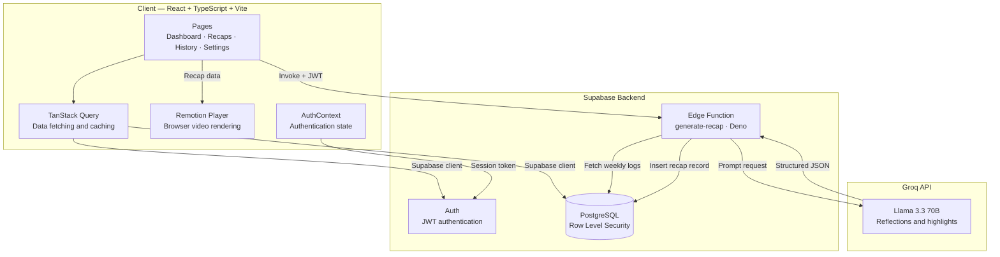
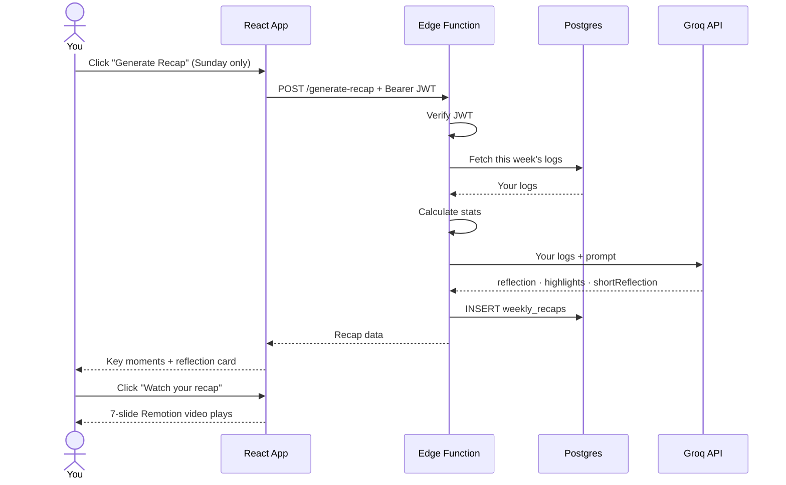
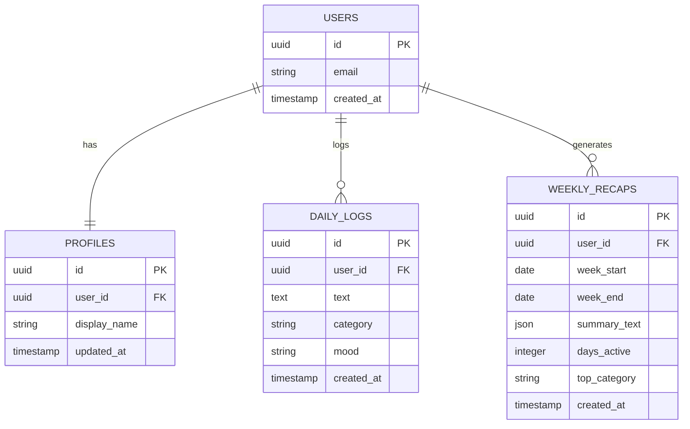

<div align="center">

#  Momentum

### *Small wins. Real progress.*

**A personal growth app that turns your daily achievements into a cinematic weekly recap video, powered by AI.**

[](https://react.dev)
[](https://www.typescriptlang.org)
[](https://supabase.com)
[](https://remotion.dev)
[](https://groq.com)
**Built by [Ayesha Dawodi](https://github.com/dlawiz83)**
</div>

---

## What is Momentum?

Most people don't realize how much they accomplish in a week. Momentum fixes that.

Log your daily wins in seconds. Every Sunday, get a **cinematic 7-slide recap video**, like a personal Spotify Wrapped; summarizing your week with AI-powered reflection, key highlights, and insights. Private, personal, and yours.

---

## ✨ Features

- **Daily Logging** — Capture wins in under 5 seconds with categories and mood tracking
- **AI Reflection** — Groq (Llama 3.3 70B) analyzes your week and writes a personalized motivational narrative
- **Cinematic Recap Video** — 7-slide animated video built with Remotion, rendered entirely in the browser
- **Weekly Rhythm** — Recap generation locked to Sundays, once per week — intentional by design
- **History Timeline** — Browse all your past weekly recaps
- **Data Export** — Download all your logs and recaps as JSON anytime
- **Secure Auth** — Email/password signup with protected routes and Row Level Security

---

## 🎬 The Recap Video

Inspired by Spotify Wrapped and LinkedIn Year in Review. 7 cinematic slides, ~36 seconds:

| Slide | Content |
|-------|---------|
| 1 | **Opening** — Your name, week range, brand intro |
| 2 | **Activity Summary** — Animated day counter, dots, stats cards |
| 3 | **Highlight Moments** — AI-extracted key moments from your logs |
| 4 | **AI Reflection** — Personalized motivational narrative (dark slide) |
| 5 | **Looking Ahead** — Gentle improvement suggestions |
| 6 | **Weekly Insight** — Most active day, consistency score, top category |
| 7 | **Closing** — Inspirational sign-off with your name |

---

## 🏗️ Architecture


---


## 🔄 Recap Generation — what actually happens



---

## 🗄️ Database



**`summary_text` stores structured JSON:**
```json
{
  "reflection": "Full 3-sentence AI motivational reflection...",
  "shortReflection": "One punchy sentence for the video.",
  "highlights": ["Key moment 1", "Key moment 2", "Key moment 3"]
}
```

---

## 🛠️ Tech Stack

| Layer | Technology | Purpose |
|-------|-----------|---------|
| Frontend | React 18 + TypeScript | UI framework |
| Build | Vite | Fast dev server + bundling |
| Styling | TailwindCSS + shadcn/ui | Design system |
| Routing | React Router v6 | Client-side routing |
| Data Fetching | TanStack Query | Server state + caching |
| Animation | Framer Motion | Page transitions |
| Video | Remotion + @remotion/player | In-browser video rendering |
| Backend | Supabase | Auth, database, edge functions |
| Database | PostgreSQL (via Supabase) | Data persistence + RLS |
| AI | Groq API (Llama 3.3 70B) | Weekly reflection generation |
| Fonts | DM Serif Display + DM Sans | Typography |

---

## 📁 Project Structure

```
momentum-recap/
├── src/
│   ├── components/
│   │   ├── ui/                    # shadcn/ui components
│   │   ├── recap-video/
│   │   │   ├── RecapVideo.tsx     # 7-slide Remotion composition
│   │   │   └── RecapVideoPlayer.tsx # Remotion <Player> wrapper
│   │   ├── AppHeader.tsx          # Nav + auth header
│   │   └── ProtectedRoute.tsx     # Auth guard
│   ├── contexts/
│   │   └── AuthContext.tsx        # Global auth state
│   ├── integrations/
│   │   └── supabase/
│   │       ├── client.ts          # Supabase client init
│   │       └── types.ts           # Auto-generated DB types
│   ├── pages/
│   │   ├── LandingPage.tsx
│   │   ├── LoginPage.tsx
│   │   ├── SignupPage.tsx
│   │   ├── DashboardPage.tsx      # Daily logging
│   │   ├── RecapsPage.tsx         # Video + AI reflection
│   │   ├── HistoryPage.tsx        # Past recaps timeline
│   │   └── SettingsPage.tsx       # Profile + data export
│   └── App.tsx                    # Routes + providers
├── supabase/
│   ├── functions/
│   │   └── generate-recap/
│   │       └── index.ts           # Edge function (Deno)
│   ├── migrations/                # SQL schema history
│   └── config.toml
├── index.html
└── package.json
```

---

## 🚀 Getting Started

### Prerequisites

- Node.js 18+
- A [Supabase](https://supabase.com) account
- A [Groq](https://console.groq.com) account (free)

### 1. Clone the repo

```bash
git clone https://github.com/dlawiz83/momentum.git
cd momentum-recap
```

### 2. Install dependencies

```bash
npm install
```

### 3. Set up Supabase

1. Create a new project at [supabase.com](https://supabase.com)
2. Go to **SQL Editor** and run the migration file at `supabase/migrations/*.sql`
3. Get your project URL and anon key from **Project Settings → Data API**

### 4. Configure environment variables

Create a `.env` file in the root:

```env
VITE_SUPABASE_URL=https://your-project.supabase.co
VITE_SUPABASE_ANON_KEY=your-anon-key
```

### 5. Deploy the edge function

In your Supabase dashboard:

1. Go to **Edge Functions** → **Create function**
2. Name it `generate-recap`
3. Paste the contents of `supabase/functions/generate-recap/index.ts`
4. Go to **Edge Functions → Manage Secrets** and add:
   - `GROQ_API_KEY` — your Groq API key
5. Go to **Edge Functions → generate-recap → Details** and turn off **Verify JWT with legacy secret**

### 6. Run locally

```bash
npm run dev
```

Open [http://localhost:5173](http://localhost:5173)

---

## 🔐 Security

- All database tables have **Row Level Security (RLS)** enabled — users can only access their own data
- JWT tokens verified on every edge function call
- Groq API key stored as a Supabase secret — never exposed to the browser
- Passwords managed entirely by Supabase Auth

---

## 📄 License

MIT © [Ayesha Dawodi](https://github.com/dlawiz83)

---

<div align="center">


*Momentum builds quietly.*

</div>
